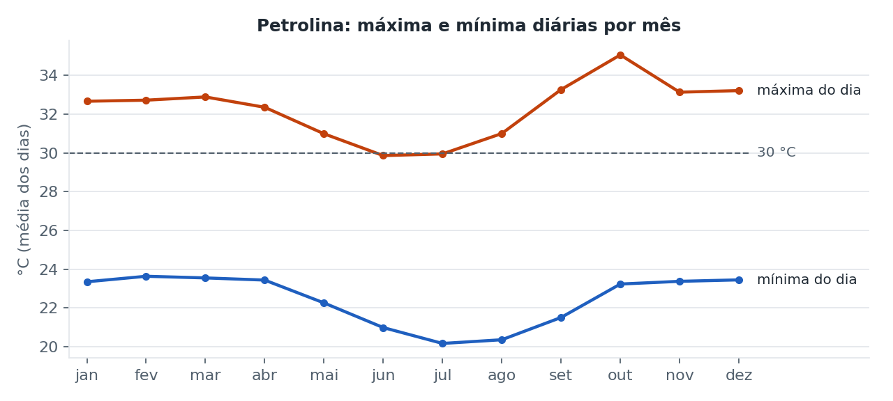
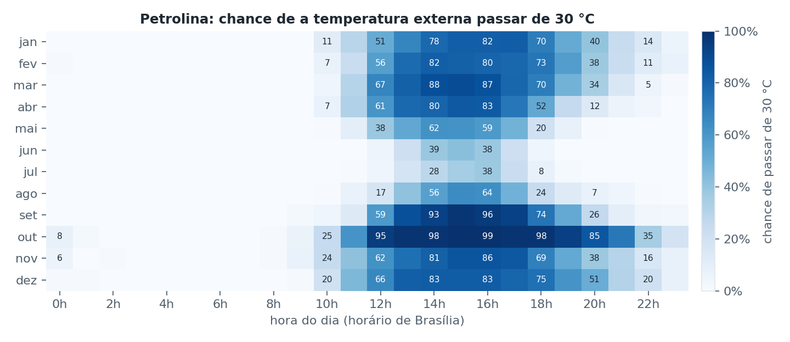
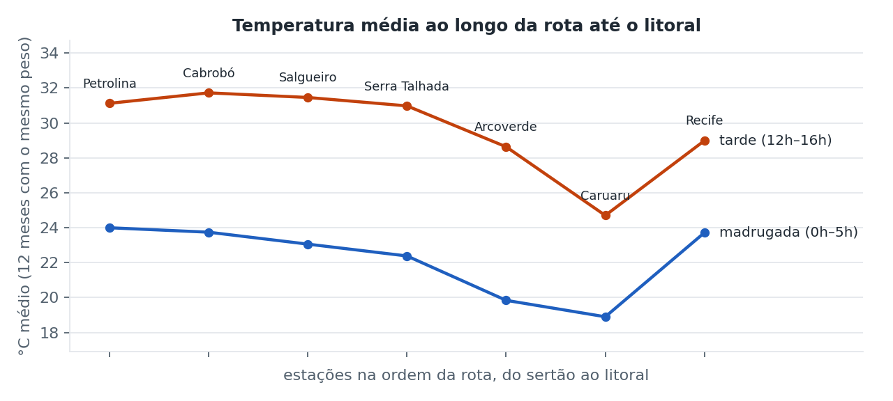

# Análise climática da rota Petrolina → Suape

Gerado por `explorar.py` a partir dos dados horários das estações automáticas do INMET
(2019–2025). Estação principal: **A307 Petrolina** (32153 horas válidas, 1330 dias completos).

## Qualidade dos dados

Percentual de horas com temperatura válida por estação: Petrolina 61% · Cabrobó 88% · Salgueiro 67% · Serra Talhada 56% · Arcoverde 70% · Caruaru 67% · Recife 47%.
As estações do INMET têm longos períodos sem leitura (sensor fora do ar): Petrolina não
registrou nenhuma hora em 2025 e perdeu metade de 2024; o arquivo de Recife vem vazio a
partir de 2022. Horas sem dado foram descartadas, nunca preenchidas. Isso reforça o valor
do sensor próprio no baú: a estação pública não garante série contínua.

## Calor em Petrolina ao longo do ano

| Mês | Máxima média (°C) | Mínima média (°C) | Horas > 30 °C | Horas > 35 °C | Horas com umidade < 30% |
|---|---|---|---|---|---|
| jan | 32.7 | 23.4 | 29% | 1% | 4% |
| fev | 32.7 | 23.6 | 29% | 1% | 3% |
| mar | 32.9 | 23.6 | 29% | 1% | 3% |
| abr | 32.3 | 23.4 | 25% | 0% | 2% |
| mai | 31.0 | 22.3 | 15% | 0% | 1% |
| jun | 29.9 | 21.0 | 7% | 0% | 0% |
| jul | 29.9 | 20.2 | 6% | 0% | 2% |
| ago | 31.0 | 20.4 | 14% | 1% | 7% |
| set | 33.3 | 21.5 | 30% | 2% | 18% |
| out | 35.1 | 23.2 | 45% | 7% | 26% |
| nov | 33.1 | 23.4 | 32% | 4% | 6% |
| dez | 33.2 | 23.5 | 33% | 3% | 8% |

- Mês mais quente: **out**, com 45% das horas acima de 30 °C.
- Mês mais ameno: **jul**, com 6%.
- O ar seco (umidade abaixo de 30%) aparece nos mesmos meses de calor, o que soma perda de
  água da fruta ao risco térmico.

## Janela de viagem

- Pico de risco às **15h**.
- Horas com menos de 5% de chance de passar de 30 °C em qualquer mês: **0h, 1h, 2h, 3h, 4h, 5h, 6h, 7h, 8h, 9h, 23h**.
- Implicação operacional: carregar, abrir portas e fazer paradas longas fora da faixa do
  meio-dia ao fim da tarde, principalmente nos meses de maior calor.

## Calor ao longo da rota

| Estação (ordem da rota) | Tarde 12h–16h (°C) | Madrugada 0h–5h (°C) |
|---|---|---|
| Petrolina | 31.1 | 24.0 |
| Cabrobó | 31.7 | 23.7 |
| Salgueiro | 31.5 | 23.1 |
| Serra Talhada | 31.0 | 22.4 |
| Arcoverde | 28.6 | 19.8 |
| Caruaru | 24.7 | 18.9 |
| Recife | 29.0 | 23.7 |

O trecho do sertão (Petrolina a Serra Talhada) é o mais quente à tarde e o de madrugada
mais amena só no agreste (Arcoverde, Caruaru). O baú enfrenta a maior carga térmica na
primeira metade da viagem. A tarde de Caruaru ficou abaixo do esperado para a cidade e deve
ser conferida (possível viés da estação); ela não muda a conclusão sobre o sertão.

## Modelo preliminar de risco térmico

Estima a chance de a temperatura externa passar de 30 °C para cada mês e hora do dia.
Treino: 2019, 2020, 2021, 2022 (22875 horas).
Teste em anos que o modelo não viu: 2023, 2024, 2025 (9278 horas).

| Métrica (anos de teste) | Valor |
|---|---|
| Erro quadrático da probabilidade (Brier) — modelo | 0.091 |
| Brier — modelo ingênuo (média geral) | 0.202 |
| Redução de erro sobre o ingênuo | 55% |
| Acerto ao marcar "hora de risco" (chance ≥ 50%) | 87% |
| Horas realmente acima de 30 °C que o modelo marcou | 62% |

Uso previsto: o painel mostra o risco externo esperado para a hora e o mês da viagem, e a
equipe pode antecipar a saída ou reforçar o monitoramento nos horários de maior risco.

## Limitações e próximos passos

- É um modelo climatológico: descreve o padrão típico, não a previsão do tempo do dia.
  O passo seguinte é usar a previsão do dia (API de previsão) no lugar da média histórica.
- Ainda não há dados de temperatura dentro do baú em viagem real. Com o protótipo físico,
  cruzar a telemetria de cada viagem com o clima externo para medir quanto o calor de fora
  explica as ocorrências fora da faixa.
- Falta cruzar com o calendário de exportação (volume por mês, ex.: Comex Stat) para
  ponderar o risco pelos meses de maior movimento.
