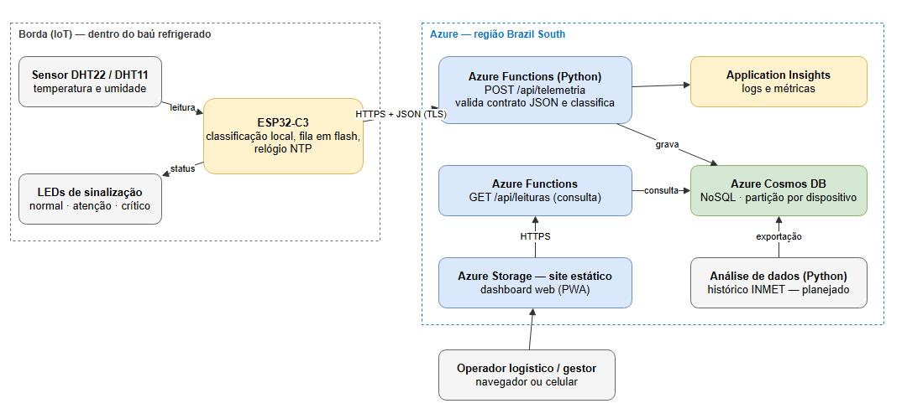

# ColdTrack — Stack Técnica

Documento de referência da arquitetura do ColdTrack: o que cada parte faz, em que tecnologia
foi feita, onde roda, como os dados circulam e como o sistema é publicado. Situação em 26/09/2026.
Para colocar um cliente novo em operação, ver [`implantacao.md`](implantacao.md).

## 1. Visão geral

O ColdTrack monitora a temperatura e a umidade dentro do baú refrigerado de caminhões que levam
frutas do Vale do São Francisco aos portos. Um sensor instalado no baú mede as condições a cada
20 segundos e envia as leituras pela internet para a nuvem. Um painel web mostra a situação
atual da carga, o histórico, os alertas e os relatórios.



O caminho de uma leitura:

1. O **sensor** (DHT11/DHT22) mede temperatura e umidade.
2. O **ESP32-C3** valida a leitura, classifica a condição da carga pela faixa do perfil da carga e acende o LED correspondente.
3. O ESP32 envia a leitura em **JSON, por HTTPS**, para a **API** no Azure.
4. A API confere a chave do sensor e o formato, classifica pela faixa da carga do veículo, grava no **banco de dados** e devolve a faixa ao sensor.
5. O **painel web**, aberto no navegador, pede os dados à API e desenha as telas. Cada empresa vê só os próprios dados.

## 2. Componentes e tecnologias

| Componente | Função | Tecnologia | Onde roda |
|---|---|---|---|
| Firmware | Leitura do sensor, LEDs, envio das leituras, fila sem conexão | C++ (Arduino Framework) | ESP32-C3 no baú (hoje simulado no Wokwi) |
| API (backend) | Recebe e valida leituras, login, cadastros, consulta de dados | Python 3.11 | Azure Functions |
| Banco de dados | Guarda empresas, usuários, sensores, veículos, viagens e leituras | NoSQL (documentos JSON) | Azure Cosmos DB |
| Painel (frontend) | Dashboard, calor na rota, alertas, relatórios, sensores, veículos, viagens, usuários | HTML, CSS e JavaScript (sem framework), PWA | Azure Storage — site estático |
| Análise de dados | Clima da rota e modelo preliminar de risco térmico | Python (Pandas, Matplotlib) | Máquina local; resultado versionado no repositório |
| Testes automáticos | Testes da API e compilação do firmware a cada envio | GitHub Actions | GitHub |

Repositórios:

| Repositório | Conteúdo |
|---|---|
| `projeto-integrador-4-periodo` | Firmware (`sketch.ino`), API (`cloud/function/`), análise (`analise/`), documentação (`docs/`) |
| `Front-End-pi` | Painel web |

## 3. Borda (IoT)

| Item | Detalhe |
|---|---|
| Microcontrolador | ESP32-C3 |
| Sensor | DHT11 na placa física; DHT22 no simulador (escolhido por `DHT_TYPE` no `secrets.h`) |
| Sinalização | LEDs verde (normal), amarelo (atenção) e vermelho (crítico) nos GPIOs 5, 6 e 7 |
| Faixa da carga | Recebida da nuvem a cada envio e guardada na flash (vale mesmo sem sinal) |
| Identidade | ID e chave próprios do sensor, gerados no painel ao registrar o sensor |
| Intervalo | Uma leitura a cada 20 s, com temporização não bloqueante (`millis`) |
| Conexão | Wi-Fi no protótipo; módulo 4G (A7670SA) com chip na versão final |
| Segurança | HTTPS com verificação do certificado do servidor (raiz DigiCert Global Root G2) |
| Relógio | Sincronizado pela internet (NTP); cada leitura leva o horário da medição |

**Leitura inconsistente (Fail-Fast).** Se o sensor devolve valor inválido (`isnan`), a leitura
não é enviada e o LED vermelho pisca.

**Sem conexão (store-and-forward).** Quando não há internet, a leitura é gravada na memória
flash do ESP32 (até 500 leituras, cerca de 2 h 45 min). Quando a conexão volta, as leituras
guardadas são enviadas da mais antiga para a mais nova, com o horário original da medição.
Assim, um trecho de estrada sem sinal não deixa buraco no histórico.

Formato enviado:

```
POST https://func-coldtrack-7319.azurewebsites.net/api/telemetria
x-device-key: <chave do sensor>
Content-Type: application/json

{"deviceId":"coldtrack-01","temperatura":12.4,"umidade":81.0,"rssi":-58,"medidoEm":1790464605}
```

Resposta, com a faixa da carga do veículo que o sensor passa a usar nos LEDs:

```
201 {"id":"…","status":"NORMAL","perfil":"manga","faixa":{"min":10.0,"max":13.0,"margem":3.0}}
```

## 4. Nuvem: serviços do Azure

O Azure é a nuvem da Microsoft: computadores alugados, oferecidos como serviços prontos.
O projeto usa a assinatura **Azure for Students**, região **Brazil South** (São Paulo).
Todos os recursos ficam no grupo de recursos `rg-coldtrack`.

| Serviço | Recurso | Para que serve |
|---|---|---|
| Azure Functions (plano Flex Consumption) | `func-coldtrack-7319` | Roda a API |
| Azure Cosmos DB for NoSQL (camada gratuita) | `cosmos-coldtrack-7319` | Banco de dados |
| Azure Storage — site estático | `stcoldtrackweb7319` | Hospeda o painel web |
| Azure Storage | `stcoldtrack7319` | Armazenamento interno da Function |
| Application Insights | `func-coldtrack-7319` | Logs e erros da API |

### 4.1 Azure Functions (serverless)

No modelo *serverless*, não existe um servidor ligado o tempo todo para administrar. O código é
entregue ao Azure, que executa a função apenas quando chega uma requisição e cobra por
execução. Para o volume do protótipo, o custo fica dentro da cota gratuita.

### 4.2 Azure Cosmos DB (NoSQL)

O Cosmos DB guarda **documentos JSON** em vez de linhas de tabela com colunas fixas. Cada
coleção de documentos é um **container** (equivalente a uma tabela). A escolha combina com
telemetria: muitos registros simples chegando continuamente, no mesmo formato JSON enviado pelo
dispositivo. A **chave de partição** define como os dados são distribuídos: as leituras são
particionadas por dispositivo, então consultar o histórico de um caminhão lê uma única partição.

### 4.3 Site estático no Azure Storage

Os arquivos do painel (HTML, CSS, JavaScript e imagens) ficam em um armazenamento com a opção
de site estático ativada e são servidos por HTTPS. Não há código executando no servidor: o
JavaScript roda no navegador do usuário e busca os dados na API.

O Azure Static Web Apps, alternativa com login pronto, não está disponível nas regiões
liberadas para a assinatura acadêmica; por isso o login foi implementado na própria API.

## 5. Modelo de dados

Banco `coldtrack`, seis containers. Todo documento (menos `empresas`) leva o `empresaId`,
e toda consulta da API filtra pela empresa de quem está logado.

| Container | Chave de partição | Conteúdo |
|---|---|---|
| `empresas` | `/id` | Transportadoras cadastradas |
| `usuarios` | `/id` (e-mail) | Pessoas com acesso ao painel |
| `dispositivos` | `/id` (ID do sensor) | Sensores registrados, com a impressão (hash) da chave |
| `veiculos` | `/id` (`<empresa>~<código>`) | Frota e o sensor instalado em cada veículo |
| `viagens` | `/id` (`<empresa>~<código>`) | Trajetos, com origem, destino, carga, início e fim |
| `leituras` | `/deviceId` | Uma leitura do sensor por documento |

Veículos e viagens são gravados com o código prefixado pela empresa: duas transportadoras
podem ter um `CT-001` cada. A API devolve só o código.

Exemplos de documentos:

```
empresas
{"id":"E-3F0EE404","nome":"Frutas do Vale","criadaEm":"2026-09-26T23:00:00+00:00"}

usuarios
{"id":"gestor@empresa.com","nome":"Gestor","perfil":"gestor","empresaId":"E-3F0EE404",
 "senhaHash":"scrypt$16384$8$1$…","sessao":0}

dispositivos
{"id":"coldtrack-02","empresaId":"E-3F0EE404","descricao":"ESP32-C3 + DHT11",
 "chaveHash":"<sha-256 da chave>","criadoEm":"2026-09-26T23:05:00+00:00"}

veiculos
{"id":"E-3F0EE404~CT-001","empresaId":"E-3F0EE404","tipo":"Caminhão baú refrigerado",
 "deviceId":"coldtrack-02","dispositivo":"ESP32-C3 + DHT11","perfil":"manga"}

viagens
{"id":"E-3F0EE404~V-DB6E09","empresaId":"E-3F0EE404","veiculo":"CT-001","origem":"Petrolina/PE",
 "destino":"Porto de Suape/PE","carga":"Manga","inicio":"2026-09-26T21:00:00+00:00","fim":null}

leituras
{"id":"3660eb0a-…","deviceId":"coldtrack-02","empresaId":"E-3F0EE404","temperatura":12.1,
 "umidade":80.0,"rssi":null,"perfil":"manga","status":"NORMAL",
 "medidoEm":"2026-09-26T23:36:45+00:00","recebidoEm":"2026-09-26T23:36:46+00:00"}
```

O formato de cada documento é validado no código da API antes de gravar.

**Classificação da carga.** Cada veículo tem um perfil de carga. A faixa normal vai de `min` a
`max`; até `margem` graus fora dela é ATENCAO; além disso, CRITICO. Frio demais também conta:
abaixo da faixa a fruta sofre dano por frio. A regra é a mesma no firmware, na API
(`contrato.py`) e no painel, e a API é a fonte (`GET /perfis`).

| Perfil | Normal | Atenção | Crítico |
|---|---|---|---|
| Demonstrativo (protótipo) | até 15 °C | até 20 °C | acima de 20 °C |
| Manga | 10 a 13 °C | 7 a 10 °C ou 13 a 16 °C | abaixo de 7 °C ou acima de 16 °C |
| Uva de mesa | -1 a 0 °C | -3 a -1 °C ou 0 a 2 °C | abaixo de -3 °C ou acima de 2 °C |

As faixas de manga e uva são referências de pós-colheita, a validar com o produtor. O DHT11 não
mede abaixo de 0 °C: para uva, usar DHT22 ou sonda DS18B20.

## 6. API

Base: `https://func-coldtrack-7319.azurewebsites.net/api`

| Método e rota | Quem usa | Permissão | Função |
|---|---|---|---|
| `POST /telemetria` | Sensor | Chave do sensor (`x-device-key`) | Valida, classifica e grava a leitura; devolve a faixa da carga |
| `POST /empresas` | Pessoa | Aberta | Cadastra a empresa e o primeiro gestor, já logado |
| `POST /login` | Pessoa | Aberta | Troca e-mail e senha por um token de acesso |
| `GET /perfis` | Painel | Aberta | Perfis de carga e faixas |
| `GET /eu` | Painel | Operador ou gestor | Dados do usuário logado e da empresa |
| `POST /senha` | Painel | Operador ou gestor | Troca a própria senha (pede a atual) |
| `GET /leituras` | Painel | Operador ou gestor | Leituras de um sensor da empresa, com filtros de período (`horas`) e `status` |
| `GET /dispositivos` | Painel | Operador ou gestor | Sensores da empresa |
| `POST /dispositivos` | Painel | Gestor | Registra sensor e devolve a chave (uma vez só) |
| `PUT`, `DELETE` em `/dispositivos/{id}` | Painel | Gestor | Gera chave nova (a anterior para de valer) ou remove |
| `GET /veiculos`, `GET /viagens` | Painel | Operador ou gestor | Frota e viagens |
| `POST`, `PUT`, `DELETE` em `/veiculos` e `/viagens` | Painel | Gestor | Cadastro, alteração e remoção |
| `GET`, `POST`, `DELETE` em `/usuarios` | Painel | Gestor | Gestão de usuários |
| `PUT /usuarios/{id}` | Painel | Gestor | Redefine a senha de quem esqueceu |

Respostas de erro: **400** (dado inválido, com a lista de erros), **401** (sem login ou token
inválido), **403** (perfil sem permissão), **404** (não encontrado ou de outra empresa),
**409** (cadastro repetido), **429** (login bloqueado por tentativas erradas).

Organização do código (`cloud/function/`):

| Arquivo | Responsabilidade |
|---|---|
| `function_app.py` | Rotas da API e acesso ao banco |
| `contrato.py` | Validação e classificação das leituras |
| `contrato.py` (perfis) | Perfis de carga e faixas de temperatura |
| `seguranca.py` | Hash de senha, token de acesso, bloqueio do login, chave de sensor |
| `cadastros.py` | Validação de empresas, usuários, sensores, veículos e viagens |
| `migrar_multiempresa.py` | Migração única dos dados do piloto para o modelo com empresas |
| `test_contrato.py`, `test_seguranca.py` | 53 testes automatizados |

## 7. Painel web

| Tela | Conteúdo |
|---|---|
| Página inicial | Apresentação do produto e login |
| Cadastro de empresa | Transportadora nova cria o acesso e entra como gestor |
| Dashboard | Leitura atual do veículo escolhido, gráfico dos últimos 30 minutos com a faixa da carga e o calor previsto na rota |
| Alertas | Ocorrências fora da faixa (leituras seguidas agrupadas), com duração e pico |
| Relatórios | Resumo de 24 h ou 7 dias, gráfico, tabela e exportação em CSV |
| Sensores | Sensores da empresa e último envio; registro, chave nova e remoção pelo gestor |
| Veículos | Situação atual de cada veículo, aviso de sensor sem sinal, etiqueta QR; cadastro pelo gestor |
| Viagens | Condição da carga do início ao fim de cada trajeto; registro pelo gestor |
| Configurações | Troca de senha, faixas de cada perfil de carga, sensores, fonte de dados; usuários e redefinição de senha (gestor) |

**Calor na rota.** O dashboard mostra, para as próximas 24 horas, a temperatura prevista na
cidade mais quente entre Petrolina e Suape (previsão Open-Meteo, sem chave de acesso), as horas
acima de 30 °C e a janela de 3 horas mais fresca para carregar em Petrolina. Junto vem o
histórico do mês pelo modelo climatológico do INMET (pasta `analise/`). Se a previsão não
carregar, aparece só o histórico.

**Etiqueta QR.** Em Veículos, cada veículo gera uma etiqueta para colar no baú. O QR abre o
painel já naquele veículo; quem escaneia ainda precisa de login.

O painel é uma PWA: pode ser instalado no celular como aplicativo. O layout funciona em
computador e celular.

## 8. Segurança

| Camada | Medida |
|---|---|
| Dispositivo → API | HTTPS com certificado verificado; chave própria de cada sensor no cabeçalho, válida só para o ID dele; o banco guarda só o hash |
| Pessoas → API | Login com e-mail e senha; token assinado (JWT) com validade de 8 horas |
| Sessão | A cada chamada a API confere o usuário no banco: trocar ou redefinir a senha, ou remover o usuário, derruba os tokens antigos na hora |
| Empresas | Cada empresa só lê e altera os próprios dados; sensor de outra empresa responde como inexistente |
| Senhas | Guardadas apenas como hash scrypt com sal aleatório; a senha nunca é armazenada |
| Permissões | Perfis Operador Logístico e Gestor, conferidos pela API em cada chamada |
| Login | Mesma resposta e mesmo tempo para e-mail inexistente e senha errada; 5 senhas erradas seguidas bloqueiam a conta por 15 minutos |
| Segredos | Fora do código: configurações da Function no Azure e `secrets.h` fora do Git |
| Navegador | CORS da API aceita somente o endereço publicado do painel e o servidor local de desenvolvimento |
| Dados | Leituras inválidas (NaN, fora da faixa física, horário impossível) são recusadas |

## 9. Publicação e testes

| Parte | Publicação automática | Publicação manual |
|---|---|---|
| API | GitHub Actions `publicar-api.yml`: a cada envio à branch `everson` que altere a API, roda os testes e publica | `bash publicar.sh` em `cloud/function/` |
| Painel | GitHub Actions `publicar-site.yml`: a cada envio à branch `everson`, confere os scripts e publica | `bash publicar.sh` no repositório do painel |
| Firmware | — | Compilado e gravado no ESP32 pelo cabo USB |

**Credencial da publicação automática.** O GitHub entra no Azure por OIDC: não existe senha
guardada no repositório. A identidade `coldtrack-github-deploy` tem permissão apenas no grupo
de recursos `rg-coldtrack` e só é aceita para a branch `everson` destes dois repositórios.
A publicação manual usa o **Azure CLI** (comando `az`) autenticado na assinatura do projeto.

Testes:

| Tipo | Onde roda | O que cobre |
|---|---|---|
| Testes automatizados da API | Máquina local e GitHub Actions | Contrato, horário, filtros, faixas por perfil, senha, token, bloqueio, chave de sensor, cadastros |
| Teste da API publicada | Script contra o Azure | 45 verificações: isolamento entre empresas, chave de sensor, troca e redefinição de senha, bloqueio |
| Compilação do firmware | GitHub Actions | Sketch compilado para ESP32-C3 com DHT22 e com DHT11 |
| Simulação | Wokwi (wokwi-cli) | Firmware real enviando ao Azure; queda de conexão; excursão térmica; faixa da manga recebida e LED de frio demais |
| Ponta a ponta | Navegador automatizado | Login, perfis, cadastros e telas no painel publicado |

## 10. Custos

Todos os serviços operam na camada gratuita ou de consumo, cobertos pelo crédito da assinatura
acadêmica. O custo previsto fora do Azure é o hardware da versão final: módulo 4G com GPS,
chip de dados e fonte veicular.

## 11. Limitações atuais e evolução

| Hoje | Evolução prevista |
|---|---|
| Conexão por Wi-Fi | Módulo 4G com chip e GPS; envio por MQTT via Azure IoT Hub (junto com o 4G: com HTTPS funcionando, trocar o transporte antes do hardware não traz ganho) |
| Wi-Fi configurado no código | Configuração pelo celular (rede de configuração do próprio ESP32), a fazer no teste da placa física |
| Faixas de manga e uva de referência | Faixas validadas com o produtor |
| Cadastro de empresa aberto, sem confirmação de e-mail | Confirmação de e-mail e limite de cadastros por origem |
| Testes no ambiente publicado | Ambiente de testes separado |

Já entregue na evolução pós-checkpoint: várias empresas com dados separados, cadastro de
empresa, chave própria por sensor, perfil de carga enviado ao sensor, troca de senha,
bloqueio de login, etiqueta QR por veículo e previsão do tempo na análise de risco.

## 12. Glossário

| Termo | Significado |
|---|---|
| API | Conjunto de endereços que recebem e devolvem dados; aqui, em JSON |
| JSON | Formato de texto para dados estruturados, usado entre dispositivo, API e painel |
| HTTPS / TLS | Comunicação criptografada pela internet |
| Serverless | Código executado sob demanda pelo provedor, sem servidor fixo para administrar |
| NoSQL | Banco que guarda documentos em vez de tabelas com colunas fixas |
| Container | Coleção de documentos no Cosmos DB (equivalente a uma tabela) |
| Chave de partição | Campo que define como os documentos são distribuídos no banco |
| JWT | Token de acesso assinado, entregue após o login |
| Perfil de carga | Faixa de temperatura de um tipo de fruta (manga, uva) |
| Hash de senha | Transformação irreversível da senha; permite conferir sem guardá-la |
| CORS | Regra do navegador que define quais sites podem chamar a API |
| PWA | Site que pode ser instalado como aplicativo no celular |
| Store-and-forward | Guardar dados sem conexão e enviar quando a conexão volta |
| CI (GitHub Actions) | Testes executados automaticamente a cada envio ao repositório |
